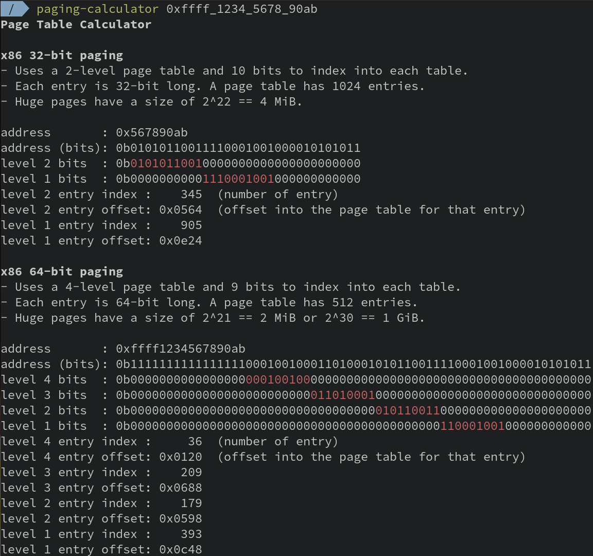

# Paging Address Calculator

A CLI utility that breaks down virtual addresses into their page table indices,
helping you understand and debug paging behavior across multiple paging modes.
Supports multiple paging implementations, such as x86, x86 with PAE, x86_64, and
x86_64 with a 5-level page table.

It takes a (virtual) address in hexadecimal format and shows you which index will be used for what
page-table level. It can be installed with

## Installation

`$ cargo install paging-calculator`.

## Usage

Valid inputs are:
- `$ paging-calculator 0x1337`
- `$ paging-calculator 0xdead_beef` (underscores are accepted)
- `$ paging-calculator 0xdead_beef x86 --pae` (underscores are accepted)
- `$ paging-calculator 0xdead_beef x86_64`

Type `$ paging-calculator help` to get a list of all supported options.

The following screenshot summarizes its functionality:

## Supported Platforms
`paging-calculator` builds and runs on Linux, macOS, and Windows.

## MSRV
The MSRV is `1.85.0` stable.

## Trivia
I worked on a project where I need to set up page-tables on my own. I had a few
problems to find out what I actually have to do and what indices are used at
which level. With the help of this utility, this task becomes quite easy.
